# Limit Projection
 
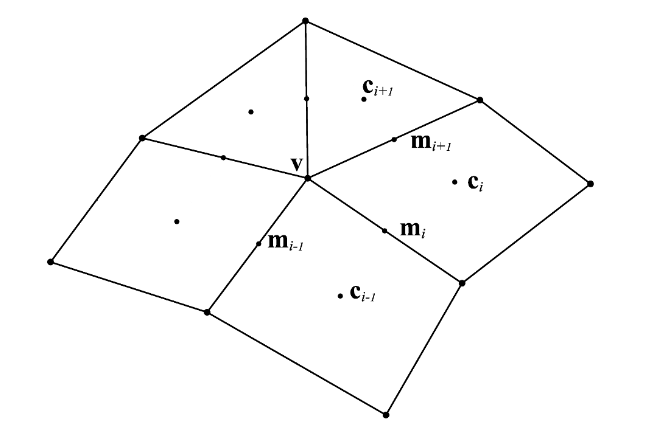 

The one-ring neighborhood of vertex v, together with its
split one-ring neighborhood. The points mi are edge midpoints,
and ci are the average of the vertices of the ith face.

The limit stencil for a subdivision surface corresponds to the domi-
nant left eigenvector of its subdivision matrix [Halstead et al. 1993].
However, this stencil is only valid if the Catmull-Clark surface is
composed solely of quads. We can generalize this stencil easily
though [Loop et al. 2009]. Let mi be the midpoint of the ith edge surrounding the
vertex v on the control mesh and ci be the average of the vertices
of the ith face according to Figure 5. The limit position is then

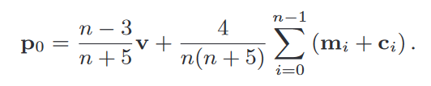 

Loop, C., Schaefer, S., Ni, T., & Castaño, I. (2009). Approximating subdivision surfaces with gregory patches for hardware tessellation. Acm Transactions on Graphics (Tog), 28(5), 1–9. https://doi.org/10.1145/1618452.1618497 
Halstead, M., Kass, M., & DeRose, T. (1993). Efficient, fair interpolation using catmull-clark surfaces. Computer Graphics -New York- Association for Computing Machinery-, 27(Spi), 35–35. 

 
For boundary cases: 
 
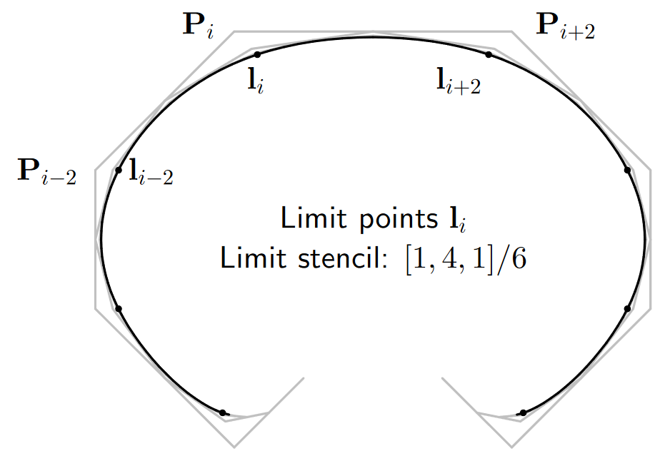 
 

# Regular quad b-spline rendering
For regular quad vertex indices we used the following convention: 
 
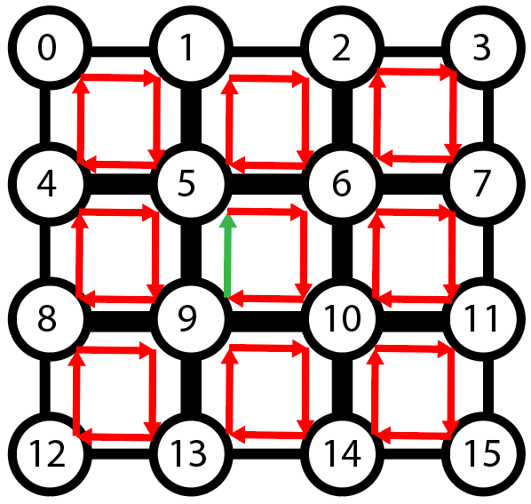 
 
As basis functions for the 16 control points we used the following b-spline implementation: 
 
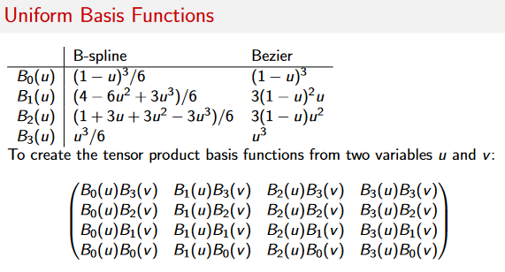 
 
 
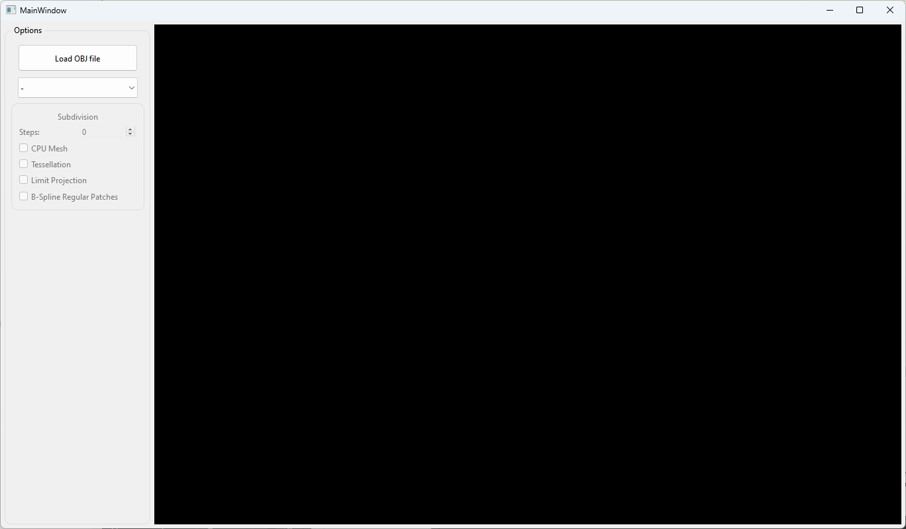 

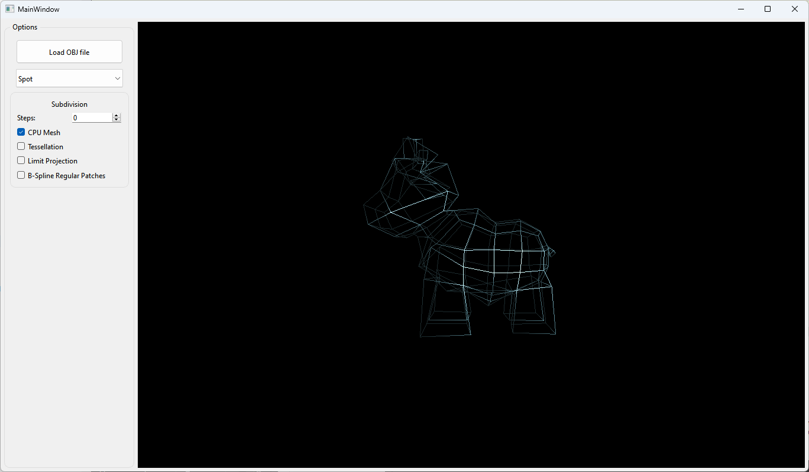 
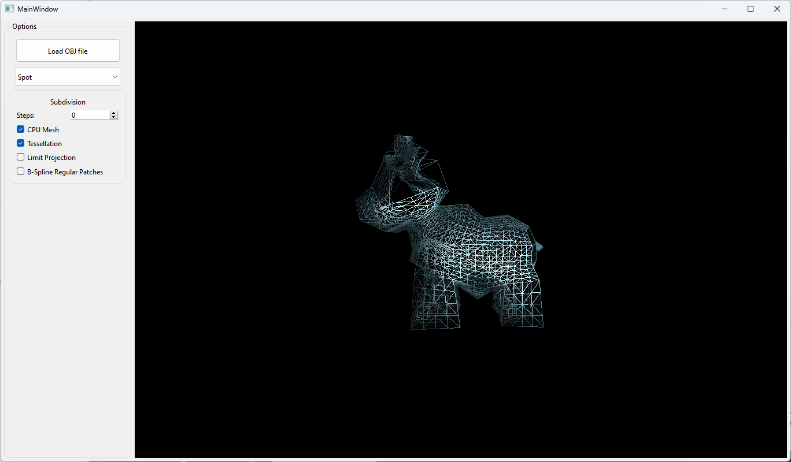 
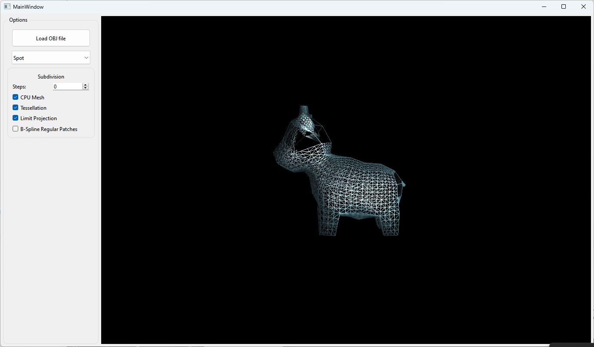 
 

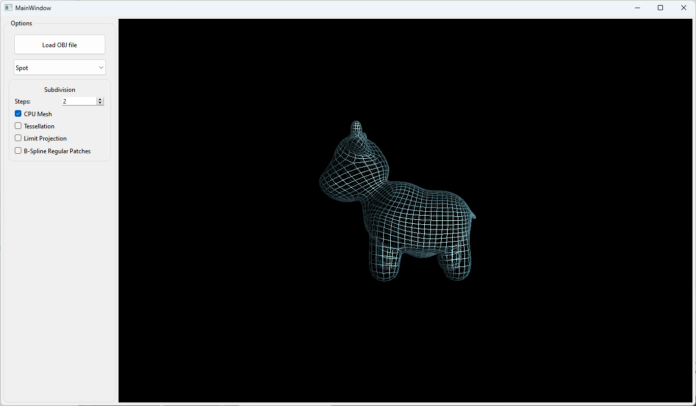 
 
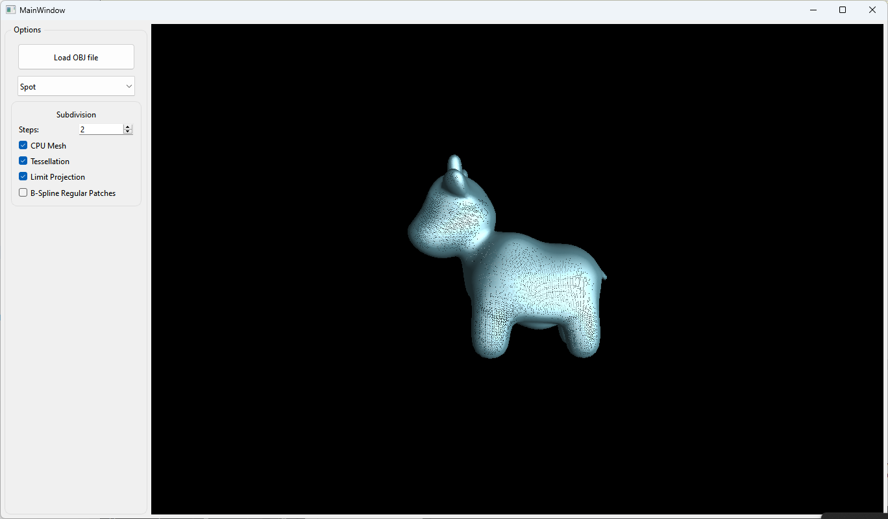 
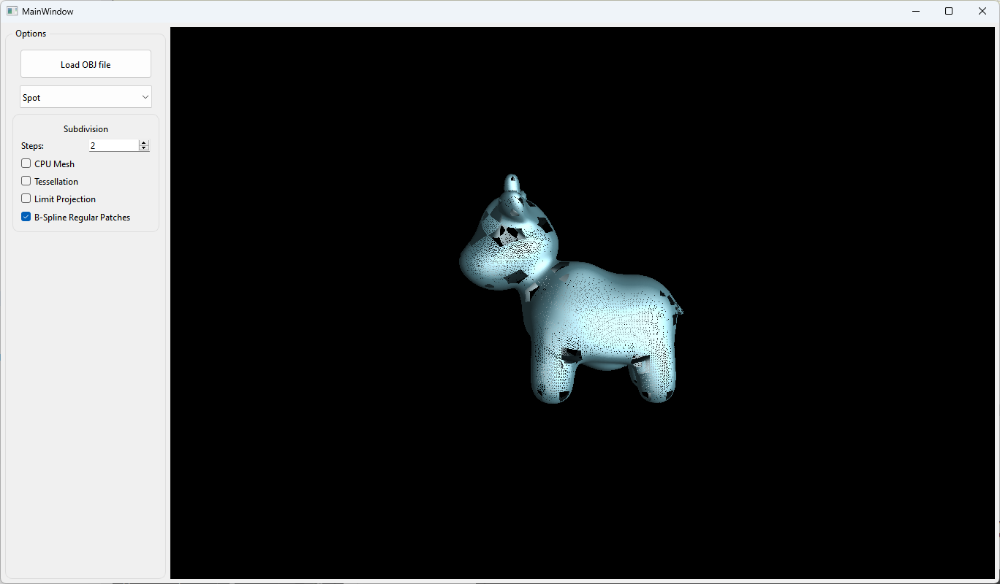 

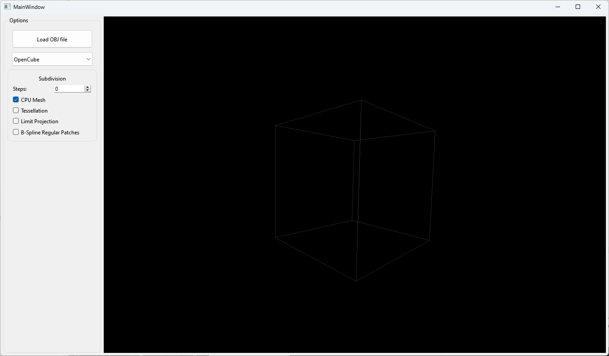 
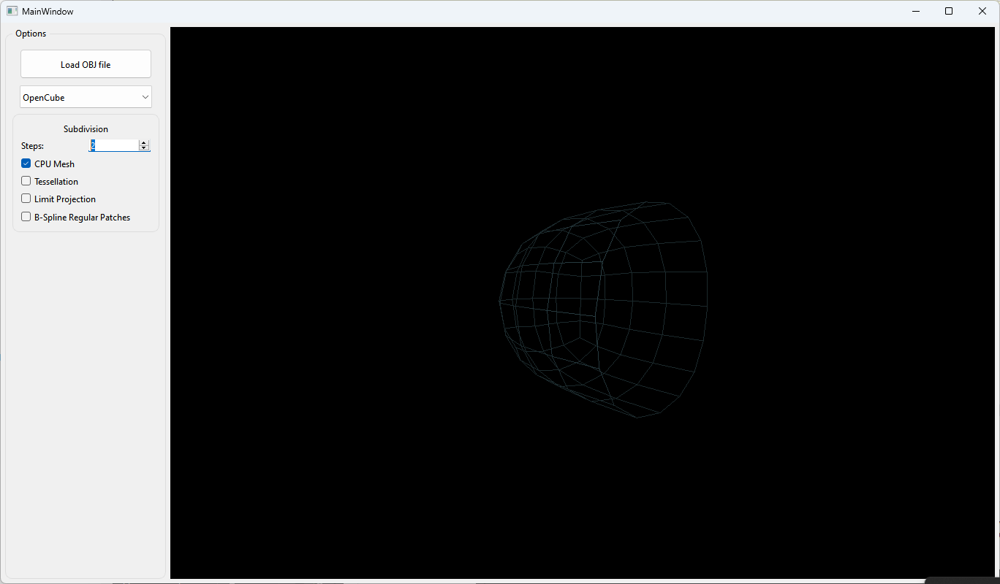 
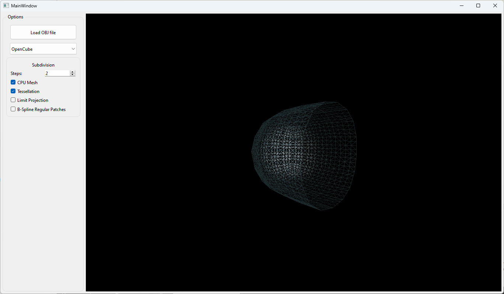 
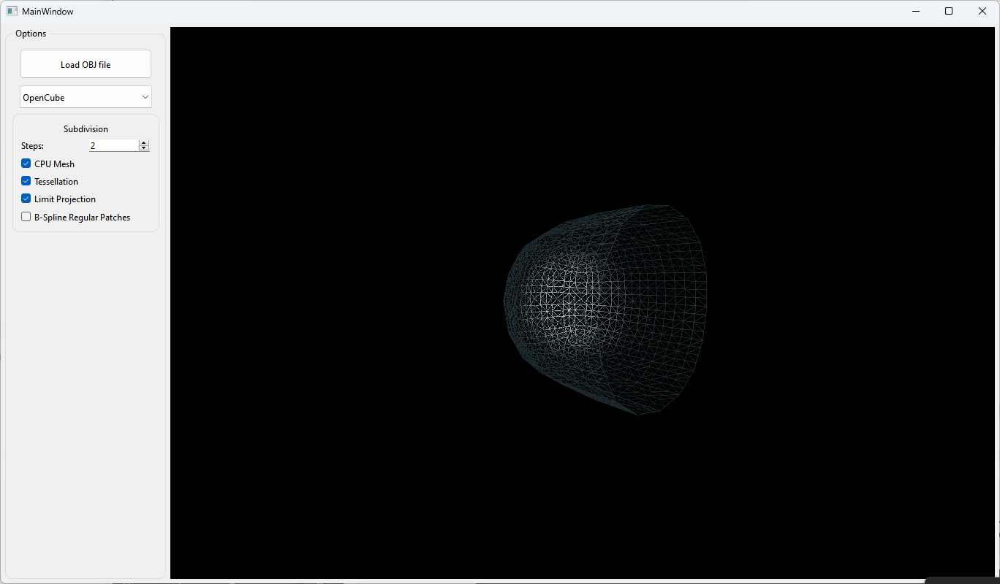 
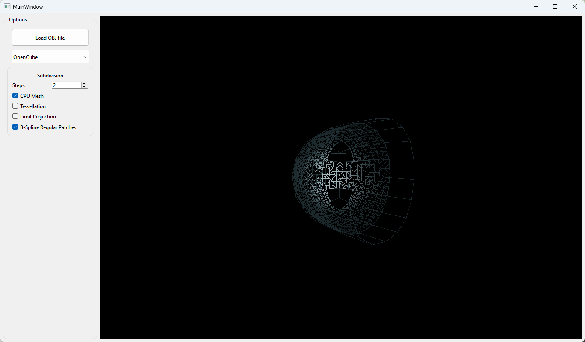 

